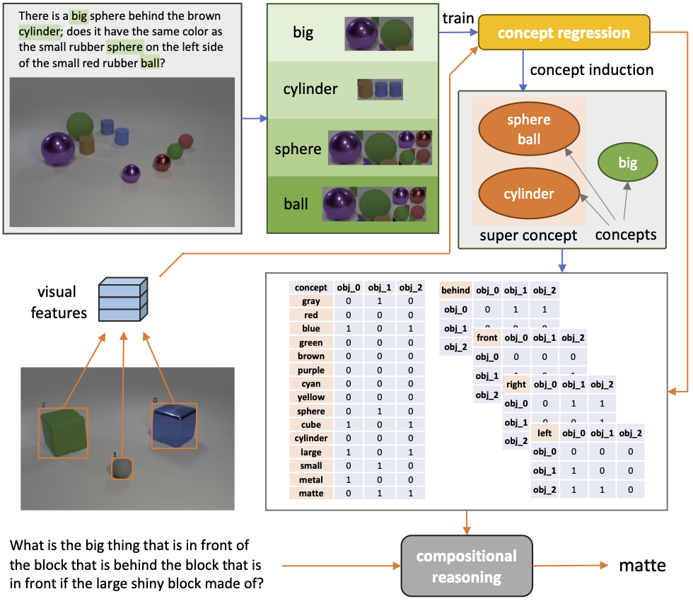

# Interpretable Visual Reasoning via Induced Symbolic Space

This is the repo to host the code  for **OCCAM** (Object-Centric Compositional Attention Model) in the following paper:

[Zhonghao Wang](https://scholar.google.com/citations?user=opL6CL8AAAAJ&hl=en), [Mo Yu](https://scholar.google.com/citations?user=vC8DssQAAAAJ&hl=en), [Kai Wang](https://scholar.google.com/citations?user=_yK8SN0AAAAJ&hl=en), [Jinjun Xiong](https://scholar.google.com/citations?user=tRt1xPYAAAAJ&hl=en), [Wen-mei Hwu](https://scholar.google.com/citations?user=ohjQPx8AAAAJ&hl=en), [Mark Hasegawa-Johnson](https://scholar.google.com/citations?hl=en&user=18O0OAwAAAAJ&view_op=list_works&sortby=pubdate) and [Humphrey Shi](https://www.humphreyshi.com/), **Interpretable Visual Reasoning via Induced Symbolic Space**, [Arxiv link](https://arxiv.org/abs/2011.11603). 

**Note:**
Our code will be released soon, stay tuned.


## Introduction
Our proposed OCCAM framework performs pure object-level reasoning and achieves a new state-of-the-art without human-annotated functional programs on the CLEVR dataset. Our framework makes the object-word cooccurrence information avaiable, which enables induction of the concepts and super concepts based on the inclusiveness and the mutual exclusiveness of words’ visual mappings. When working on concepts instead of visual features, OCCAM achieves comparable performance, proving the accuracy and sufficiency of the induced concepts.

<p align="center">
  
</p>

## Results
In this table, we report the comparison of our object-level compositional reasoning framework to the state-of-the-art methods. * indicates the method uses external program annotations. 
| method       | overall  |  count   |  exist   | comp<br>numb | query<br>attr | comp<br>attr |
| :----------- | :------: | :------: | :------: | :-------: | :--------: | :-------: |
| [Human](https://openaccess.thecvf.com/content_ICCV_2017/papers/Johnson_Inferring_and_Executing_ICCV_2017_paper.pdf)    |   92.6   |   86.7   |   96.6   |   86.5    |    95.0    |   96.0    |
||||||||
| [NMN*](https://openaccess.thecvf.com/content_cvpr_2016/papers/Andreas_Neural_Module_Networks_CVPR_2016_paper.pdf)     |   72.1   |   52.5   |   72.7   |   79.3    |    79.0    |   78.0    |
| [N2NMN*](https://openaccess.thecvf.com/content_ICCV_2017/papers/Hu_Learning_to_Reason_ICCV_2017_paper.pdf)   |   83.7   |   68.5   |   85.7   |   84.9    |    90.0    |   88.7    |
| [IEP*](https://openaccess.thecvf.com/content_ICCV_2017/papers/Johnson_Inferring_and_Executing_ICCV_2017_paper.pdf)     |   96.9   |   92.7   |   97.1   |   98.7    |    98.1    |   98.9    |
| [TbD*](https://openaccess.thecvf.com/content_cvpr_2018/papers/Mascharka_Transparency_by_Design_CVPR_2018_paper.pdf)     |   99.1   |   97.6   |   99.4   |   99.2    |    99.5    |   99.6    |
| [NS-VQA*](https://proceedings.neurips.cc/paper/2018/file/5e388103a391daabe3de1d76a6739ccd-Paper.pdf)  | **99.8** | **99.7** | **99.9** | **99.9**  |  **99.8**  | **99.8**  |
||||||||
| [RN](https://papers.nips.cc/paper/2017/file/e6acf4b0f69f6f6e60e9a815938aa1ff-Paper.pdf)       |   95.5   |   90.1   |   93.6   |   97.8    |    97.1    |   97.9    |
| [FiLM](https://arxiv.org/pdf/1709.07871.pdf)     |   97.6   |   94.5   |   93.8   |   99.2    |    99.2    |   99.0    |
| [MAC](https://arxiv.org/pdf/1803.03067.pdf)      |   98.9   |   97.2   |   99.4   | **99.5**  |    99.3    |   99.5    |
| [NS-CL](http://nscl.csail.mit.edu/data/papers/2019ICLR-NSCL.pdf)    |   98.9   | **98.2** |   99.0   |   98.8    |    99.3    |   99.1    |
| [OCCAM (ours)](https://arxiv.org/pdf/2011.11603.pdf) | **99.4** |   98.1   | **99.8** |   99.0    |  **99.9**  | **99.9**  |


## Bibtex
```
@article{wang2020interpretable,
  title={Interpretable Visual Reasoning via Induced Symbolic Space},
  author={Wang, Zhonghao and Yu, Mo and Wang, Kai and Xiong, Jinjun and Hwu, Wen-mei and Hasegawa-Johnson, Mark and Shi, Humphrey},
  journal={arXiv preprint arXiv:2011.11603},
  year={2020}
}
```
